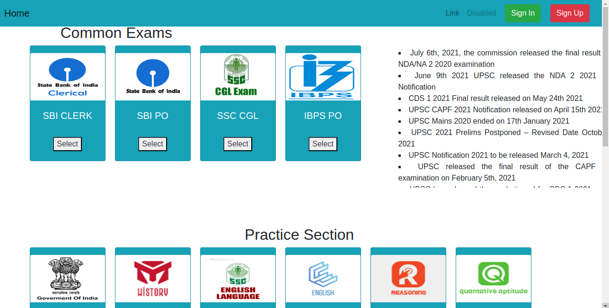
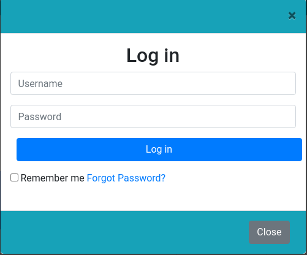
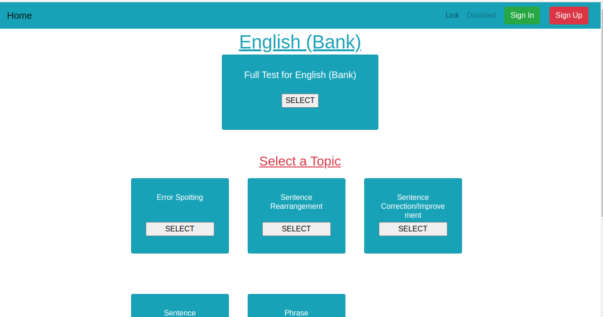
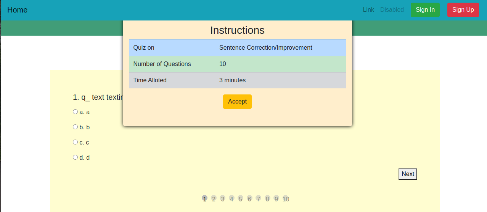
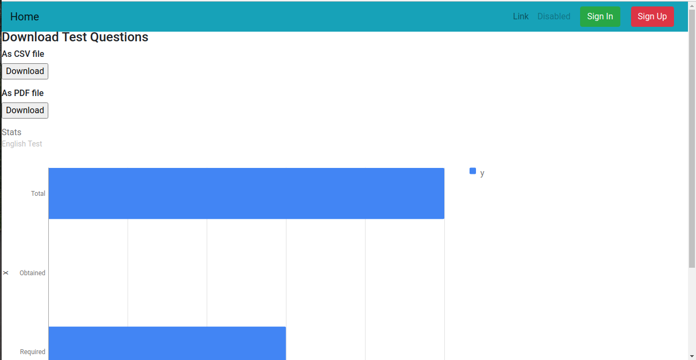
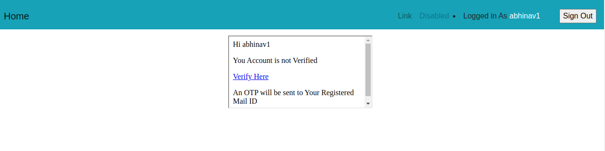
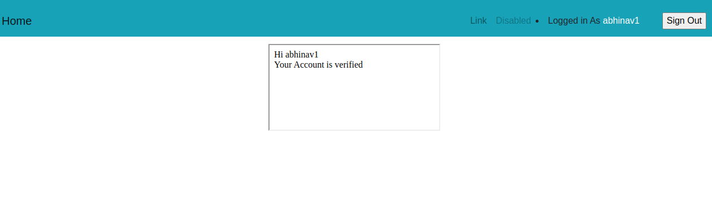

TheGkApp,
FrameWork : Django

This webapp is made with Python in the backend and HTML on frontend

Includes : 
 User Login, Signup, Otp verification Using Gmail API.
 MCQ based Exams, Short with 10 Questions, Long with 30 Questions,
 User Analysis: The Data Visualisation based on the exams given.
 
 
 # Index Page

# Login

# Sign Up

# Select a Topic

# Quiz

# Results

# Otp login/ User Profile

# verification after otp
